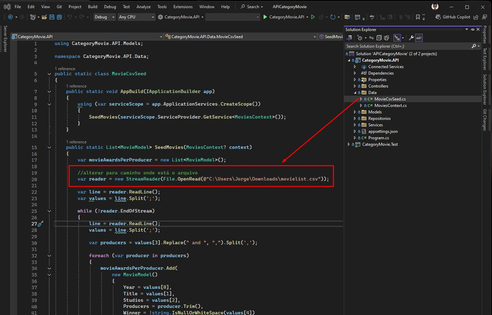
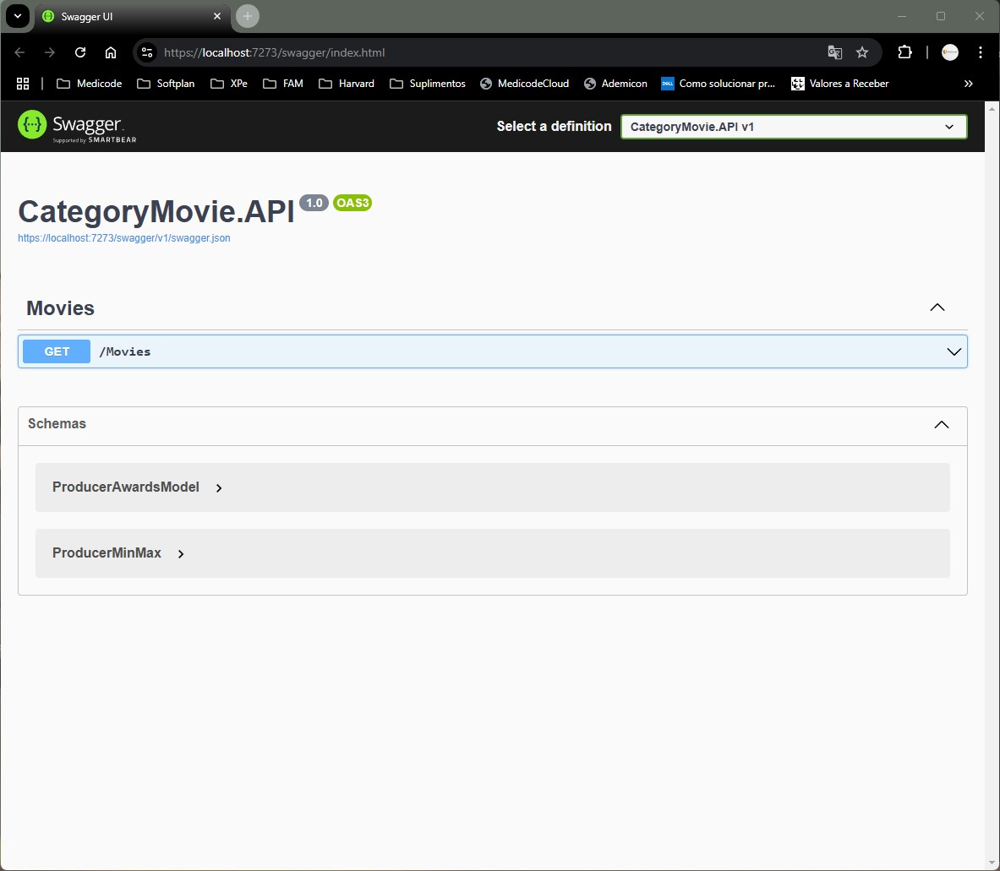
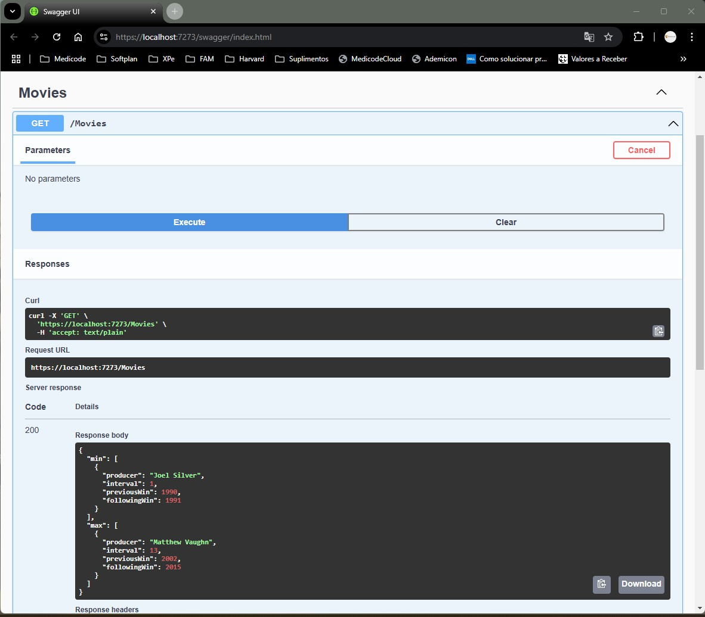

# API RESTful para leitura da lista de indicados e vencedores da categoria Pior Filme do Golden Raspberry Awards.

## Instruções para rodar o projeto

- Clonar o projeto no GitHub "https://github.com/medidrones/APICategoryMovie.git".
- Abrir o projeto no Visual Studio. 
  - OBS: Projeto foi desenvolvido no .NET 6.
- Baixar o arquivo "movielist.csv" contigo na pasta "Utils", e salvar o arquivo no diretório Downloads.
- Antes de rodar o projeto, alterar para o caminho do diretório Downloads, onde foi salvo o arquivo "movielist.csv", conforme imagem abaixo.

- Para obter os intervalos entre os vencedores, rodar o projeto, deixando como inicialização "CategoryMovie.API", e realizar um Get do método “/movies” dentro do Swagger, conforme imagens abaixo.

- Para executar os testes de implementação, executar todos no Visual Studio.